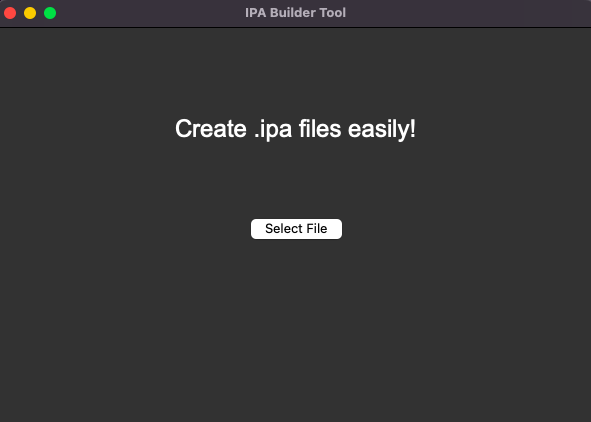

# IPABuilderTool
Make .ipa files easily.

<div align="center">
  
  
</div>

## How to use
* Install the requirements:
```
pip install -r requirements.txt
```

* Execute the file:
```
python3 gui.py
```
* Select a file

* Click on "Create IPA"

* Your .ipa file will be created on the project path
